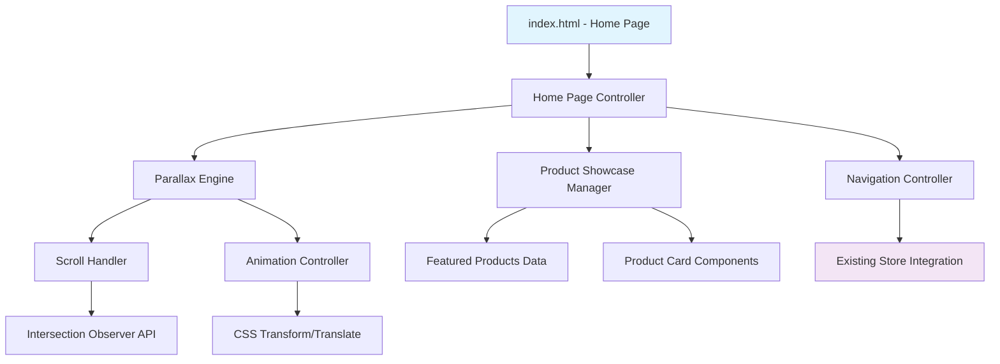
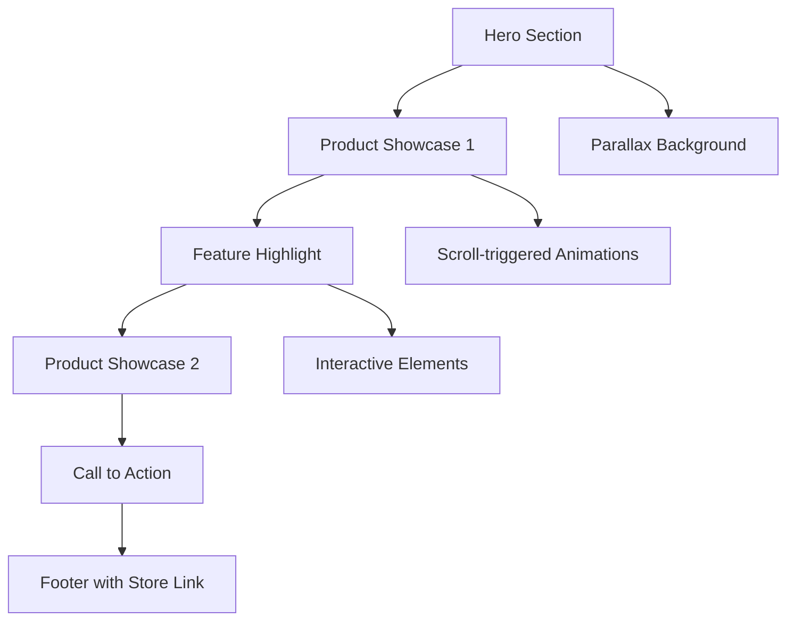

# Design Document: Parallax Scrolling Home Page

## Overview
The parallax scrolling home page will be implemented as a new entry point to the Premium Store 3D website, featuring smooth scroll-triggered animations and Apple-inspired design aesthetics. The page will showcase featured products with rich visual effects while maintaining seamless integration with the existing 3D store functionality.

## Architecture

### High-Level Architecture


### File Structure Integration
```
Premium-Store-3D/
├── index.html (modified - now home page)
├── store.html (new - existing content moved here)
├── script.js (enhanced with home page logic)
├── styling.css (enhanced with parallax styles)
├── assets/
│   ├── images/
│   │   ├── hero-bg.jpg
│   │   ├── product-showcase/
│   │   └── apple-style-assets/
│   └── data/
│       └── featured-products.json
└── components/
    ├── parallax-controller.js
    ├── product-showcase.js
    └── smooth-scroll.js
```

## Components and Interfaces

### 1. Parallax Engine
```javascript
class ParallaxController {
    constructor(options)
    init()
    handleScroll(scrollY)
    updateElements(elements, scrollProgress)
    destroy()
}
```

**Responsibilities:**
- Manage scroll event listeners with throttling
- Calculate scroll progress and element positions
- Apply transform calculations for parallax effects
- Handle performance optimization

### 2. Product Showcase Manager
```javascript
class ProductShowcase {
    constructor(containerId, productData)
    render()
    initializeAnimations()
    handleProductClick(productId)
    navigateToStore(productId)
}
```

**Responsibilities:**
- Render featured product cards
- Manage product showcase animations
- Handle navigation to existing 3D store
- Integrate with existing product data

### 3. Navigation Controller
```javascript
class NavigationController {
    constructor()
    setupRouting()
    navigateToStore()
    navigateToHome()
    preserveStoreState()
}
```

**Responsibilities:**
- Handle routing between home page and store
- Preserve existing store functionality
- Manage URL state and browser history

## Data Models

### Featured Product Model
```javascript
interface FeaturedProduct {
    id: string
    name: string
    shortDescription: string
    heroImage: string
    showcaseImages: string[]
    price: number
    currency: string
    features: string[]
    isAvailableInStore: boolean
    storeProductId?: string
}
```

### Parallax Element Model
```javascript
interface ParallaxElement {
    element: HTMLElement
    speed: number
    direction: 'vertical' | 'horizontal'
    startOffset: number
    endOffset: number
    property: 'translateY' | 'translateX' | 'scale' | 'opacity'
}
```

## Page Structure and Sections

### Section Layout


### CSS Architecture
```scss
// Main structure
.home-page {
    .hero-section { /* Full viewport height with parallax bg */ }
    .product-showcase { /* Featured product sections */ }
    .feature-highlight { /* Brand/technology highlights */ }
    .cta-section { /* Call to action for store */ }
}

// Parallax system
.parallax-container { /* Overflow and perspective settings */ }
.parallax-element { /* Transform and transition properties */ }
.parallax-bg { /* Background attachment and positioning */ }

// Apple-inspired components
.premium-card { /* Product showcase cards */ }
.smooth-button { /* Interactive buttons with hover effects */ }
.typography-system { /* Apple-like font hierarchy */ }
```

## Error Handling

### Performance Fallbacks
- **Reduced Motion:** Detect `prefers-reduced-motion` and disable parallax
- **Low Performance:** Monitor frame rates and reduce effects if needed
- **Mobile Optimization:** Use CSS-only parallax or disable on touch devices

### Data Handling
- **Missing Products:** Show placeholder cards with "Coming Soon" state
- **Image Loading:** Progressive loading with skeleton placeholders
- **Network Errors:** Graceful degradation to static content

### Integration Errors
- **Store Navigation:** Fallback to direct URL navigation if routing fails
- **State Preservation:** Local storage backup for user preferences

## Testing Strategy

### Unit Testing
```javascript
// Test parallax calculations
describe('ParallaxController', () => {
    test('calculates correct transform values')
    test('handles edge cases for scroll bounds')
    test('respects performance settings')
})

// Test product showcase
describe('ProductShowcase', () => {
    test('renders products correctly')
    test('handles missing product data')
    test('navigates to store properly')
})
```

### Integration Testing
- Navigation flow between home page and existing store
- Parallax performance across different devices
- Responsive behavior at various breakpoints

### Visual Testing
- Cross-browser parallax rendering
- Animation smoothness and timing
- Apple-inspired design consistency

## Performance Considerations

### Optimization Strategies
1. **Scroll Throttling:** Limit scroll event frequency to 60fps
2. **Intersection Observer:** Only animate visible elements
3. **CSS Transforms:** Use `transform3d` for hardware acceleration
4. **Image Optimization:** WebP format with fallbacks
5. **Lazy Loading:** Progressive image loading for product showcases

### Monitoring
- Core Web Vitals tracking
- Animation frame rate monitoring
- Memory usage for scroll handlers

## Security Considerations

### Content Security
- Sanitize any dynamic product content
- Validate image URLs and sources
- Secure integration with existing store authentication

### Performance Security
- Prevent scroll event abuse
- Rate limiting for navigation actions
- Safe handling of user preferences storage
